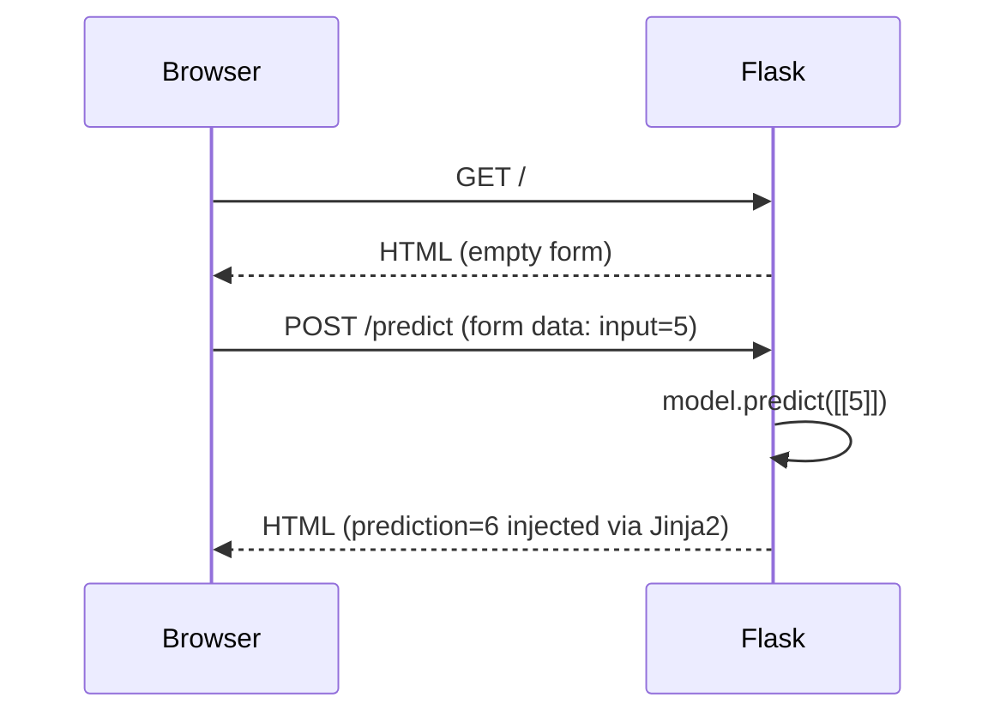
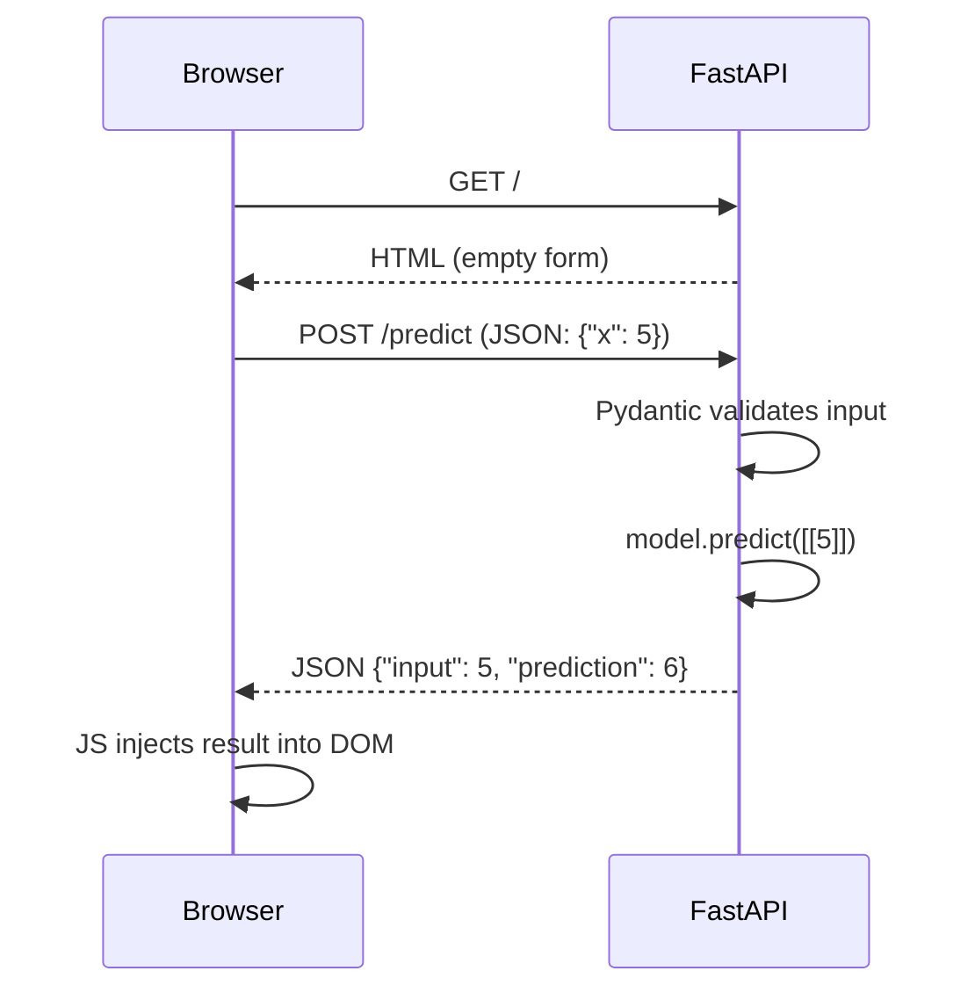
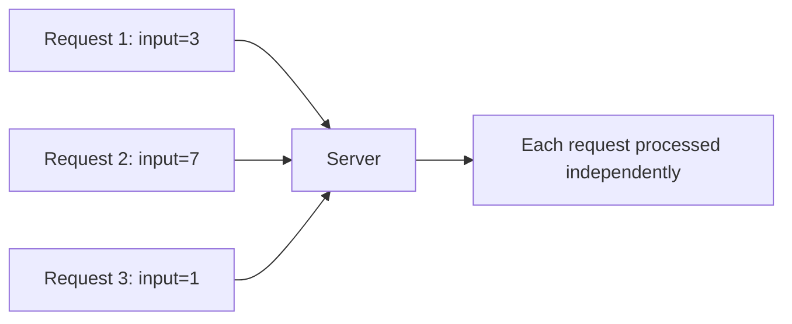
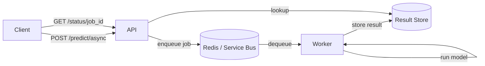
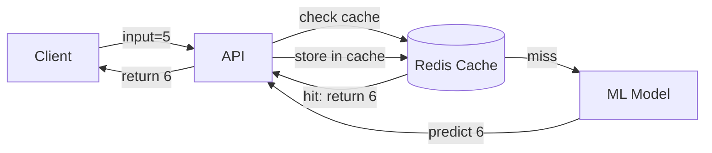
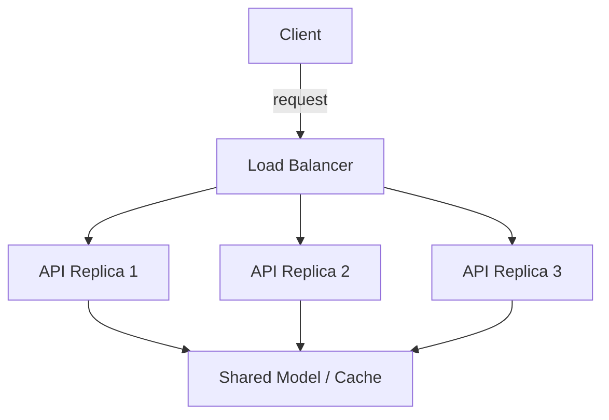

# System Design — Learning Repository

A hands-on repository documenting the study and implementation of system design concepts — from foundational API development to distributed systems, databases, and cloud-scale architecture.

Each concept is implemented from scratch, hardened incrementally, and deployed to real infrastructure.

---

## Progress

| Area | Status |
|---|---|
| Stateless REST APIs | ✅ In progress |
| Input validation & error handling | ✅ Done |
| Async & task queues | 🔜 Next |
| Databases | 🔜 Planned |
| Caching | 🔜 Planned |
| Load balancing | 🔜 Planned |
| Fault tolerance | 🔜 Planned |
| Stateful APIs | 🔜 Planned |
| Cloud deployment (Azure) | 🔜 Planned |
| Observability | 🔜 Planned |

---

## Repository Structure

```
system-design/
│
├── APIs/
│   ├── 1_simple_flask_api.py       # Flask — sync, form-based, Jinja2
│   ├── 2_simple_fastapi.py         # FastAPI — async-ready, Pydantic, JSON
│   └── templates/
│       └── index.html
│
├── databases/                      # coming soon
├── caching/                        # coming soon
├── load-balancing/                 # coming soon
└── README.md
```

---

## Concepts Covered

### 1. APIs

The starting point. An API (Application Programming Interface) is a contract between a client and a server — the client sends a request, the server processes it and returns a response.

This repo uses a simple linear regression model (`output = input + 1`) as the payload. The model is intentionally trivial so all complexity stays in the infrastructure, not the ML.

#### Flask vs FastAPI

| | Flask | FastAPI |
|---|---|---|
| Type | WSGI (sync) | ASGI (async-native) |
| Validation | Manual (`try/except`) | Automatic (Pydantic) |
| Docs | None | Auto-generated `/docs` |
| Server | `flask run` or `python app.py` | `uvicorn app:app` |
| Template rendering | `request.form` → Jinja2 | JS `fetch()` → JSON response |

#### Request flow — Flask



#### Request flow — FastAPI



#### What stateless means

Every request carries all the information the server needs. The server holds no memory of previous requests. No sessions, no stored state.



This is the foundation of scalable APIs — stateless servers can be replicated horizontally without coordination.

---

## Full Roadmap

### Phase 1 — APIs ← current
- [x] Flask REST API (sync, Jinja2, form-based)
- [x] Input validation, error handling, logging, `/health` endpoint
- [x] FastAPI (Pydantic, JSON, auto docs)
- Async endpoints (`async def`) and when to use them
- Background tasks
- API versioning (`/api/v1/predict`)

### Phase 2 — Async & Queuing
- What async means and when it matters
- Celery + Redis — task queue pattern
- `/predict/async` → returns `job_id`
- `/status/{job_id}` → poll for result
- Azure Service Bus as a managed queue



### Phase 3 — Databases
- When to use SQL vs NoSQL
- PostgreSQL — relational, ACID, joins
- Redis — in-memory, key-value, caching
- Connection pooling
- ORM basics (SQLAlchemy)
- Stateful APIs — persisting prediction history

### Phase 4 — Caching
- Why caching exists — latency vs freshness tradeoff
- Cache-aside pattern
- TTL, cache invalidation
- Redis as a cache layer in front of the model



### Phase 5 — Load Balancing & Scalability
- Vertical vs horizontal scaling
- Round-robin, least connections, IP hash strategies
- Stateless APIs scale horizontally — why this matters
- Azure Load Balancer / Application Gateway
- Stress testing with Locust



### Phase 6 — Fault Tolerance
- What happens when a service goes down
- Retries with exponential backoff
- Circuit breaker pattern
- Health checks and readiness probes
- Graceful degradation

### Phase 7 — Latency & Throughput
- Latency = time for one request
- Throughput = requests per second
- P50, P95, P99 percentiles — why averages lie
- Profiling bottlenecks
- Benchmarking with `locust` and `wrk`

### Phase 8 — Cloud Deployment (Azure)
- Dockerize Flask and FastAPI apps
- Azure Container Registry (ACR) — store images
- Azure Container Apps — serverless autoscaling containers
- Azure Service Bus — managed message queue
- Azure Cache for Redis — managed Redis
- Azure API Management (APIM) — rate limiting, auth, versioning
- Azure Key Vault — secrets management
- Azure Monitor + Application Insights — logging and tracing
- CI/CD with GitHub Actions → ACR → Container Apps

### Phase 9 — Observability
- Structured logging (JSON logs, correlation IDs)
- Distributed tracing
- Metrics — request count, error rate, latency histograms
- Alerting

---

## Key Concepts — Quick Reference

| Concept | One line |
|---|---|
| Stateless API | Server holds no memory between requests |
| Stateful API | Server or DB tracks session/history across requests |
| Async | Don't block while waiting — handle other requests instead |
| Queue | Decouple producers and consumers — absorbs traffic spikes |
| Cache | Store expensive results — trade freshness for speed |
| Load balancer | Distribute traffic across replicas |
| Circuit breaker | Stop calling a failing service — fail fast |
| P99 latency | 99% of requests complete within this time |
| Horizontal scaling | Add more servers |
| Vertical scaling | Add more CPU/RAM to one server |

---

## Tech Stack

| Layer | Technology |
|---|---|
| API (sync) | Python, Flask |
| API (async) | Python, FastAPI, Uvicorn |
| Validation | Pydantic |
| ML model | scikit-learn, joblib |
| Queue | Celery, Redis → Azure Service Bus |
| Database | PostgreSQL, Redis |
| Containers | Docker |
| Cloud | Azure (Container Apps, ACR, APIM, Key Vault, Monitor) |
| Load testing | Locust |
| CI/CD | GitHub Actions |

---

## Running Locally

**Flask**
```bash
python 1_simple_flask_api.py
# visit http://127.0.0.1:5000
```

**FastAPI**
```bash
uvicorn 2_simple_fastapi:app --reload
# visit http://127.0.0.1:8000
# API docs at http://127.0.0.1:8000/docs
```